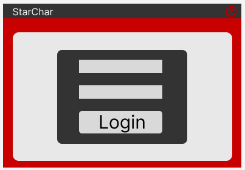
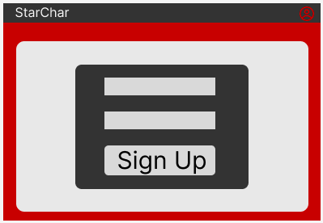
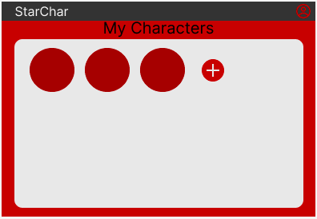
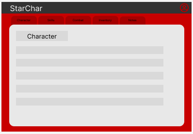
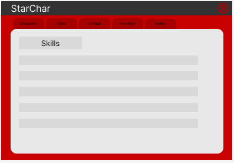
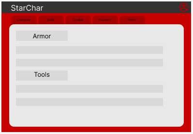
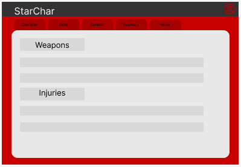
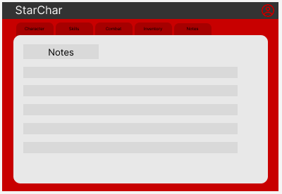

# Star Wars Character Sheets

## Project Description

This project is based on Star Wars roleplaying game from fantasy flight games([Source](https://www.fantasyflightgames.com/en/starwarsrpg/)). This eliminates the use of pencil and paper from play sessions, and you'll be able to digitize your character sheets and bring them anywhere you go. This is largely beneficial for sessions that rotate between remote sessions and in-person sessions.

Think Dungeons & Dragons character sheets, but translated for the use in Star Wars RPG.

## Collaborators

[Davis Nguyen](https://github.com/DarcXnite) | [Grace Narez](https://github.com/gracenarez333)

## Tech Stacks

- MongoDb
- Express.js
- React
- Node.js

## RESTful Routing Chart

## Wireframes

==>

## User Stories

- [ ] As a user, I want to be able to log in and out while keeping characters saved
- [ ] As a user, I want to be able to create multiple characters
- [ ] As a user, I want to be able to build my skills
- [ ] As a user, I want to take notes
- [ ] As a user, I want to keep track of all my stats
- [ ] As a user, I should be able to choose my careers
- [ ] As a user, I want to be able to save character instances
- [ ] As a user, I want to have the ability to complete full CRUD on characters

## Goals

### MVP

- [x] Create back-end for character sheet saving
- [x] Create account and delete account
- [ ] Create user log-in and log-out
- [ ] Create page 1 (Character name, desc, motivations, stats)
- [ ] Create page 2 (Careers & skills)
- [ ] Create page 3 (Combat)
- [ ] Create page 4 (Inventory)
- [ ] Create page 5 (Notes)
- [ ] Style character sheets

### Stretch

- [ ] Allow user to change color schemes (light side, or dark side)
- [ ] Dice rolling
- [ ] Make it for mobile

### Potential Roadblocks

- No forseeable potential roadblocks at this time.
